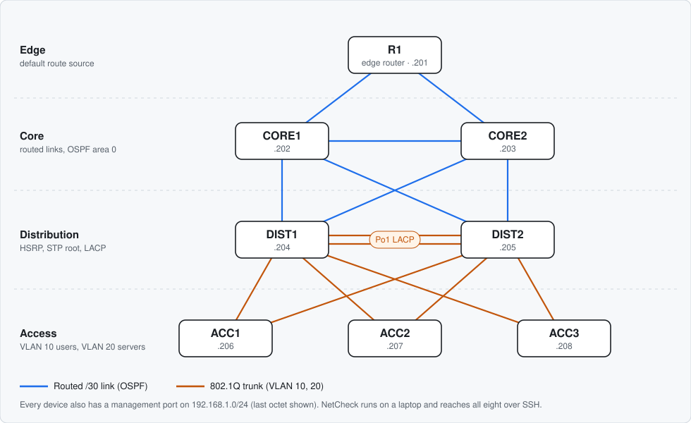
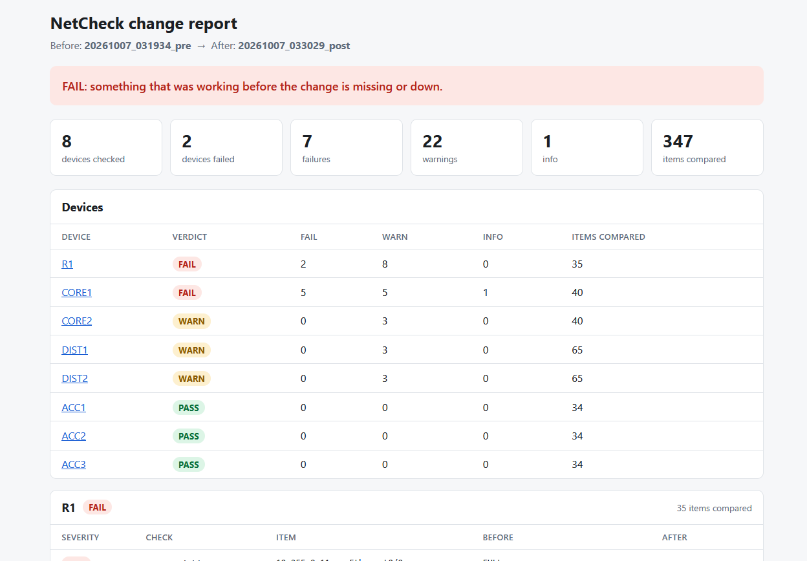
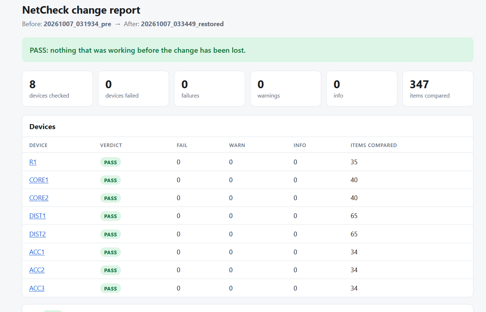

# NetCheck [*I Turned a Three-Hour Network Maintenance Check Into Three Minutes With Python*]

Change validation for network devices. NetCheck takes a snapshot of the network before a change and another after it, then tells you exactly what is different and gives every device a PASS, WARN or FAIL verdict. It also audits device configurations against hardening rules and can push the fixes safely.

Built and tested on an eight-node Cisco lab in EVE-NG.

## Why

After a maintenance window, someone has to prove the network is as healthy as it was before. Doing that by hand means running the same `show` commands on every device and comparing the output by eye, usually at 3 AM. It is slow, and the one line that matters is easy to miss.

The idea comes from the blog post *I Turned a Three-Hour Network Maintenance Check Into Three Minutes With Python*, whose author built a parallel collector and named automatic pre/post comparison as the next step. NetCheck is that next step: it does not just collect the evidence, it reads it.

## What it does

| Script | Purpose | Changes devices? |
|---|---|---|
| `collect.py` | Connects to every device in parallel, runs read-only `show` commands and saves a dated snapshot | No |
| `compare.py` | Compares two snapshots and writes an HTML report with a verdict per device | No, it never connects |
| `audit.py` | Checks saved configurations against 12 hardening rules | No, it never connects |
| `harden.py` | Pushes reviewed hardening lines, with a lockout safety net | Yes, only with `--apply` |
| `lab/build_lab.py` | Builds the whole EVE-NG lab from code: nodes, links and startup configs | Builds the lab |

## The lab



Eight Cisco IOL nodes: OSPF in the core, HSRP and spanning-tree root split across two distribution switches, an LACP EtherChannel between them, and three access switches. It fits in an EVE-NG VM with 8 GB of RAM.

## Validating a change

```powershell
python collect.py --label pre
# ... make the change ...
python collect.py --label post
python compare.py pre post --open
```

In the lab test, one core uplink was shut and one OSPF network statement was removed. NetCheck flagged the affected devices:



After the change was rolled back, the same comparison came back clean, which proves the rollback worked:



The comparison covers interface state, OSPF neighbors, the routing table, CDP neighbors, VLANs, trunks, switch ports, spanning-tree root and port roles, EtherChannel members, HSRP state, software version and restarts. Timers, ages and counters are ignored, so two snapshots of an untouched network compare as identical.

| Verdict | Meaning |
|---|---|
| PASS | Nothing that was working has been lost |
| WARN | Something changed and a person should look, for example a route lost one of two paths |
| FAIL | Something that was working is now missing or down |

`compare.py` exits with code 1 on any FAIL, so it can gate a change in a pipeline.

## Auditing and hardening

```powershell
python collect.py --label pre-harden
python audit.py pre-harden
python harden.py                  # dry run: shows the plan, changes nothing
python harden.py --only R1 --apply
python harden.py --apply
python collect.py --label post-harden
python compare.py pre-harden post-harden
python audit.py post-harden
```

The first audit of the lab found the same three gaps on all eight devices:

```
  Result  Severity  Check                                      Failing devices
  PASS    HIGH      Remote access is SSH only (no telnet)      -
  PASS    HIGH      Privileged password is stored as a hash    -
  PASS    HIGH      Local accounts use hashed secrets          -
  PASS    MEDIUM    SSH version 2 only                         -
  PASS    MEDIUM    Web management interface is off            -
  FAIL    MEDIUM    Management access is limited by an ACL     all 8
  PASS    MEDIUM    Idle sessions time out                     -
  PASS    LOW       Passwords are obscured in the config       -
  PASS    LOW       Login banner is present                    -
  FAIL    LOW       Logs are sent to a central server          all 8
  FAIL    LOW       Clock is synchronised with NTP             all 8
  PASS    LOW       No SNMP v1/v2c community strings           -
```

`harden.py` then pushed the fixes in `hardening.yml` to every device:

```
  Device  Address          Status       Lines  Seconds  Note
  R1      192.168.1.201    APPLIED      7      3.26     new login verified, configuration saved
  CORE1   192.168.1.202    APPLIED      7      3.27     new login verified, configuration saved
  ...
8 applied, 0 not applied
```

The follow-up comparison showed no losses, and the second audit scored 12 out of 12 on every device.

## Results from the lab

- A full collection from 8 devices takes about 3.2 seconds.
- Each comparison checks 347 items across the 8 devices.
- Two snapshots of the unchanged network taken 15 minutes apart produced zero differences.
- The audit score went from 9/12 to 12/12 on all 8 devices after hardening, with nothing broken.

These are lab numbers on eight nodes. The value is not speed at this scale; it is that the tool does not get tired and miss a line.

## Safety design

- `collect.py` refuses to run anything that is not a `show` command.
- Passwords, hashes, keys and SNMP communities are redacted before a configuration is written to disk.
- Credentials come from environment variables or a prompt. They are never stored.
- One bad command or one unreachable device never stops the rest of the run.
- A rejected password is never retried, so the tool cannot lock an account.
- `harden.py` does nothing without `--apply`. After pushing, it opens a second login before saving. If that login fails, it pushes the rollback lines through the session it still has open and saves nothing.

## Getting started

### Build the lab

On the EVE-NG server, with the IOL images in place:

```bash
python3 lab/build_lab.py
# start all nodes in the EVE-NG web UI and wait about two minutes
python3 lab/build_lab.py --enable-ssh
```

The default lab login is `admin` / `Lab-Admin-123`. Set `LAB_USER` and `LAB_PASSWORD` before building to choose your own. These are lab credentials only.

### Set up the tool

```powershell
python -m venv .venv
.\.venv\Scripts\Activate.ps1
python -m pip install -r requirements.txt
python collect.py --dry-run
python collect.py --only R1
python collect.py --label baseline
```

Edit `inventory.yml` for your own devices and `commands.yml` for the checks to run on each device role.

## A note on old SSH

The IOL images run IOS 15.x, which only offers SHA-1 key exchange and `ssh-rsa` host keys. Paramiko 5 removed both, so `requirements.txt` pins Paramiko 4.0.0. `collect.py` warns if it finds a newer version. On modern devices this pin is not needed.

## Tests

```powershell
python -m pip install -r requirements-dev.txt
ruff check .
pytest
```

The comparison tests run against real output captured from the lab (`tests/fixtures/baseline`), then check that specific faults are caught and that timers and ages are ignored. The same checks run in GitHub Actions on every push.

## Limitations

- Tested on Cisco IOS only, on eight lab nodes. Other platforms need their own commands and parsers.
- The audit checks that a setting is configured, not that it is working. For example, it confirms an NTP server is set, not that the clock has synchronised.
- The comparison reads operational state, not configuration, so it does not yet show which config lines changed.

## Roadmap

- NetBox as the source of truth, with Nornir for inventory and execution, to compare live state against intended state.
- A configuration diff between snapshots.
- A firewall at the edge for a multi-vendor check.

## Layout

```
collect.py  compare.py  audit.py  harden.py
inventory.yml  commands.yml  hardening.yml
lab/build_lab.py        builds the EVE-NG lab
docs/                   topology diagram and report screenshots
tests/                  pytest suite and real-output fixtures
.github/workflows/      lint and tests on every push
```
